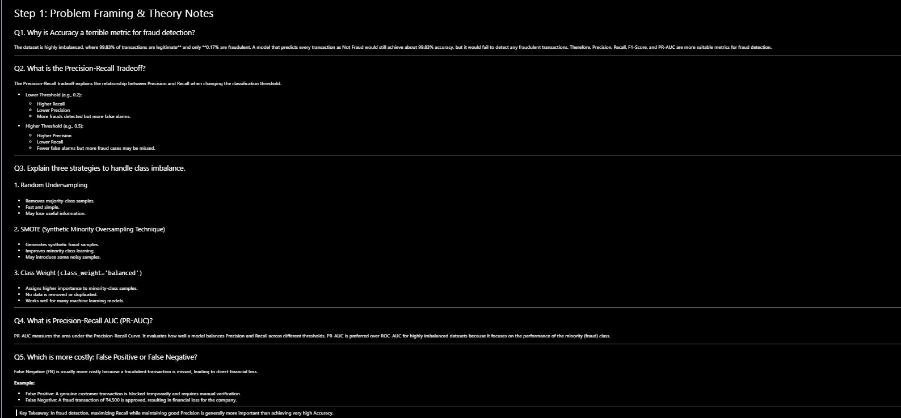
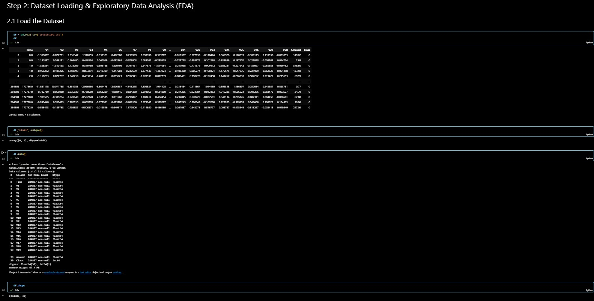
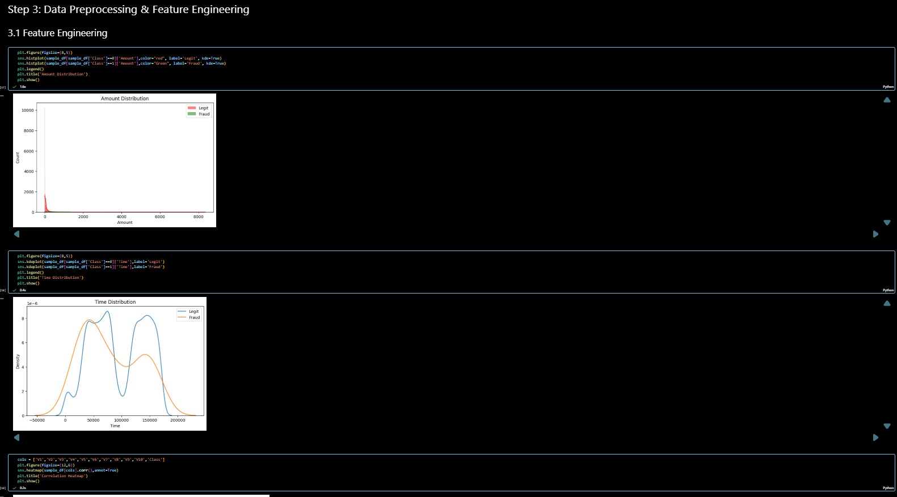
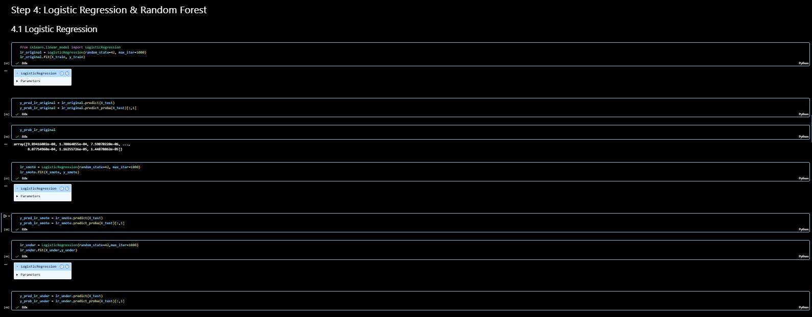
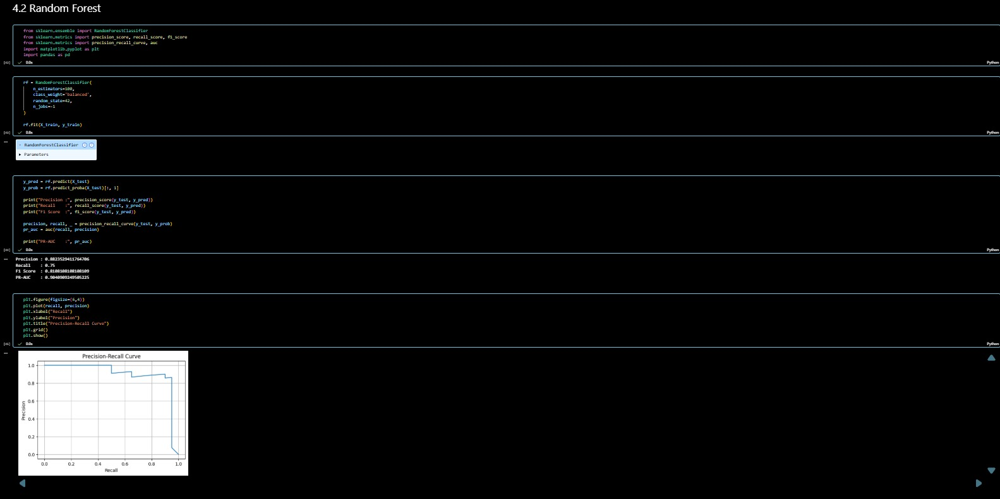
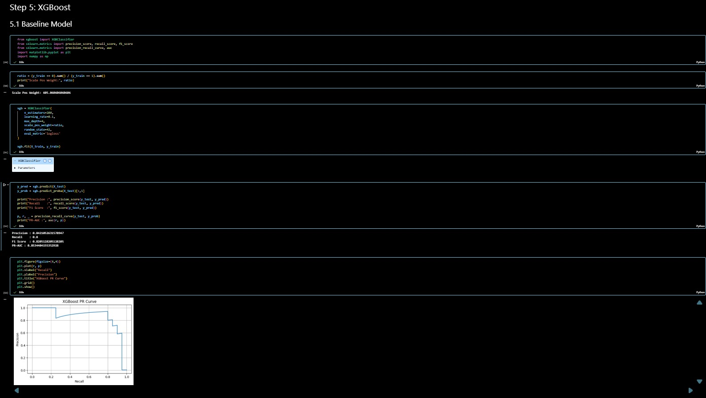
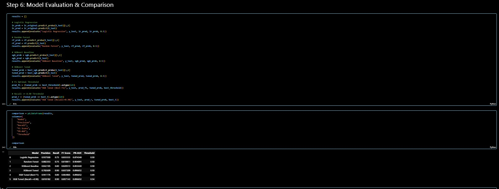
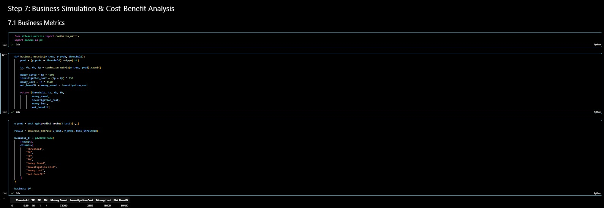

# 💳 Credit Card Fraud Detection using Machine Learning

## 📌 Project Overview

This project detects fraudulent credit card transactions using Machine Learning techniques. Since fraud datasets are highly imbalanced, multiple imbalance handling strategies and classification models were evaluated to improve fraud detection performance.

The project includes data preprocessing, feature engineering, model building, threshold optimization, business cost-benefit analysis, and deployment using a machine learning pipeline.

---
📺 **Presentation Video:**  
👉 **https://drive.google.com/drive/folders/1PxcH4-Tk8_DrAttUAK9w8TMegtQx56yy?usp=sharing**


# 🎯 Objectives

- Detect fraudulent credit card transactions.
- Handle severe class imbalance effectively.
- Compare multiple machine learning models.
- Optimize the classification threshold.
- Evaluate the financial impact using business metrics.
- Build a deployment-ready machine learning pipeline.

---

# 📂 Dataset

- **Dataset:** Credit Card Fraud Detection
- **Target Variable:**
  - `0` → Legitimate Transaction
  - `1` → Fraudulent Transaction
- Highly imbalanced dataset requiring special handling techniques.

---

# 🚀 Project Workflow

## 📖 Step 1 – Problem Framing & Theory

This section explains why accuracy is not a suitable metric for fraud detection and introduces Precision, Recall, F1-Score, PR-AUC, class imbalance handling, and the business impact of fraud.

<p align="center">

</p>

---

## 📊 Step 2 – Dataset Loading & Exploratory Data Analysis (EDA)

Performed:

- Loaded the dataset
- Checked missing values
- Checked duplicate values
- Analyzed target distribution
- Explored important features
- Visualized class imbalance

<p align="center">

</p>

---

## ⚙️ Step 3 – Data Preprocessing & Feature Engineering

Performed:

- Log transformation
- Feature engineering
- Standard scaling
- Train-test split
- SMOTE oversampling
- Random undersampling
- Class weight balancing

<p align="center">

</p>

---

## 🤖 Step 4 – Logistic Regression

Three Logistic Regression models were trained and compared:

- Original Dataset
- Class Weight Balanced
- SMOTE Dataset

Evaluation Metrics:

- Precision
- Recall
- F1-Score
- PR-AUC

<p align="center">

</p>

---

## 🌲 Step 5 – Random Forest

Random Forest was trained using the best imbalance strategy.

Model Configuration:

- n_estimators = 100
- class_weight = balanced
- random_state = 42

Feature importance and Precision-Recall curve were also analyzed.

<p align="center">

</p>

---

## 🚀 Step 6 – XGBoost

Implemented:

### Baseline Model

- XGBClassifier

### Hyperparameter Tuning

- RandomizedSearchCV
- Cross Validation

### Threshold Optimization

- Default Threshold (0.5)
- Best F1 Threshold
- Recall ≥ 0.90 Threshold

<p align="center">

</p>

---

## 📈 Step 7 – Model Evaluation & Comparison

Compared the following models:

- Logistic Regression
- Random Forest
- XGBoost Baseline
- Tuned XGBoost
- Tuned XGBoost (Best F1 Threshold)
- Tuned XGBoost (Recall ≥ 0.90 Threshold)

Evaluation Metrics:

- Precision
- Recall
- F1-Score
- PR-AUC

<p align="center">

</p>

---

## 💼 Step 8 – Business Simulation & Cost-Benefit Analysis

Business analysis was performed by calculating:

- Money Saved
- Investigation Cost
- Money Lost
- Net Benefit

Threshold sensitivity analysis identified the threshold that maximized business value.

<p align="center">

</p>

---

# 🏆 Best Model

**Tuned XGBoost** achieved the best overall performance.

### Why?

- High Precision
- High Recall
- Best F1-Score
- Highest PR-AUC
- Threshold optimized for fraud detection
- Maximum business benefit

---

# 📦 Deployment

The final model was saved using a Scikit-learn Pipeline.

```python
import joblib

model = joblib.load("fraud_detection_model.pkl")
```

Predictions can be generated using:

```python
probability = model.predict_proba(X_test)
```

---

# 📁 Repository Structure

```
credit-fraud-detection-supervised-learning/
│
├── FraudDetection_SupervisedLearning.ipynb
├── fraud_detection_model.pkl
├── README.md
├── requirements.txt
├── summary_report.md
│
└── images/
    ├── step1.jpg
    ├── eda.jpg
    ├── preprocessing.jpg
    ├── logistic.jpg
    ├── randomforest.jpg
    ├── xgboost.jpg
    ├── comparison.jpg
    └── business.jpg
```

---

# 🛠️ Technologies Used

- Python
- Pandas
- NumPy
- Matplotlib
- Scikit-learn
- Imbalanced-learn
- XGBoost
- Joblib
- Jupyter Notebook

---

# ▶️ Installation

Clone the repository:

```bash
git clone https://github.com/your-username/credit-fraud-detection-supervised-learning.git
```

Install dependencies:

```bash
pip install -r requirements.txt
```

Run the notebook:

```bash
jupyter notebook
```

Open:

```
FraudDetection_SupervisedLearning.ipynb
```

Run all cells in sequence.

---

# 📌 Key Learnings

- Handling imbalanced datasets
- Feature engineering
- Logistic Regression
- Random Forest
- XGBoost
- Hyperparameter tuning
- Threshold optimization
- Precision-Recall analysis
- Business cost-benefit evaluation
- Model deployment using Scikit-learn Pipeline

---

# 👨‍💻 Author

**Abhiraj Medhat**

Machine Learning Practical Project  
Red & White Skill Education

---

⭐ If you found this project useful, consider starring the repository!
